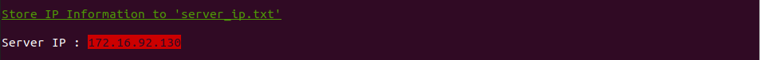

# InnoTIS

InnoTIS 是 Innodisk and Aetina 用來提供 Aetina Server 運行AI模型的效果，我們結合了 NVIDIA Triton Inference Server 的技術讓使用者可以透過gRPC的方式傳送資料到我們的 Aetina Server 進行 AI 推論進而取得辨識結果。

---
## Feature

* Custom version which only have three model could use.
   1. **DENSENET_ONNX** ( NVIDIA sample )
   2. **YOLOV4** ( COCO Dataset )
   3. **YOLOV4_WILL** ( Can Detect Does People Wear A Mask )
* To modify your custom code (`*.cpp` `*.h`), please visit my [notion](https://max-c.notion.site/Custom-Model-with-YOLOv4-277f3185e53c4f25be5d46cb117cb12a)。 
* I use `gRPC` in `innotis-server`, `HTTP service` will open but disable to use.
---
## How to use？

1. **Install NVIDIA Driver and Docker**
   1. [Build Triton on Windows ( With Docker )](https://max-c.notion.site/Build-Triton-on-Windows10-With-Docker-3d14124387674bb983ac4c8bee1734e8)
   2. [Build Triton on Ubuntu ( With Docker )](https://max-c.notion.site/Build-Triton-on-Ubuntu-With-Docker-db35b8f09d2c47d5b68b0c29c11a27db)
2. **Run `innotis-server`**
   1. Download `innotis-server`
        ```bash
        $ git clone https://github.com/MaxChangInnodisk/innotis-server.git
        $ cd innotis-server
        ```
   2. Run `init.sh` ( Only need first time )
        ```bash
        $ ./init.sh
        ```
        * Please remind the ip of server, you can alos find it in `server_ip.txt`.
            
        * The folder (`build/`, `triton-deploy/`) will be generated
   3. Run `run.sh` 
        ```bash
        $ ./run.sh
        ```
        * Make sure GRPC and HTTP service is started.
            

3. **Run `innotis-client` ( with another terminal )**

    Github: [innotis-client](https://github.com/MaxChangInnodisk/innotis-client)

    * **DockerHub**: pull image & run container from docker hub
        ```bash
        $ docker run -p 5000:5000 -t maxchanginnodisk/innotis
        ```
    * **Dockerfile**: you can also build from docker file
        * Please visit [innotis-client](https://github.com/MaxChangInnodisk/innotis-client) to get more information.
    * **Miniconda**: virtual environment might be a great idea for developer
        * Please visit [innotis-client](https://github.com/MaxChangInnodisk/innotis-client) to get more information.

4. **Open browser and enter url** ( [`localhost:5000`](http://localhost:5000) ).
    * Triton IP must be modify to <server_ip>, you can find <server_ip> in "server_ip.txt" which will be generated when run `init.sh`
5. **Have fun.**
    
---
## Reference

Thanks for:
* [YOLOv4 on Triton Inference Server with TensorRT](https://github.com/isarsoft/yolov4-triton-tensorrt)
* [TensorRTx](https://github.com/wang-xinyu/tensorrtx)

